# 

## 3 Projecct making learning based core technology used material-css

## About

 `  Travel agency app, Cloudvp cloud based app, Busniess based appy`

 

## Feature
- `Welcome Travel app,`
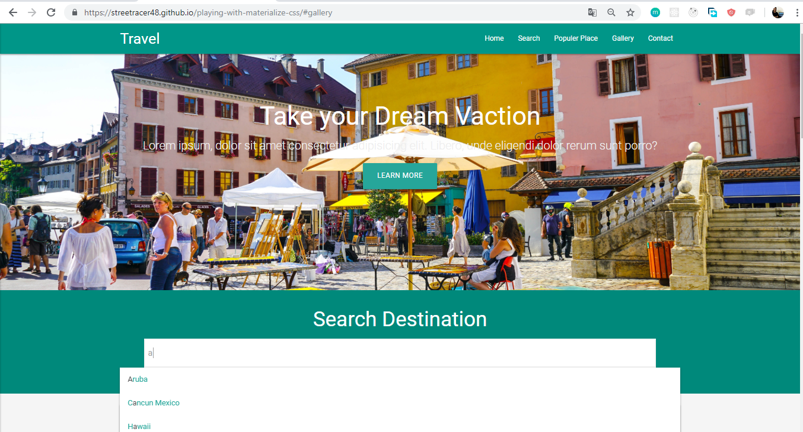

- `Most Popular place and ficking`
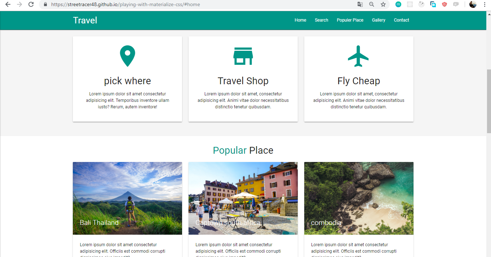

- `Mobile Responsive`
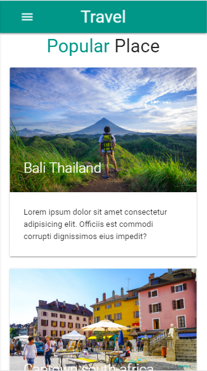

travelmob2m

- `Mobile Responsive home`
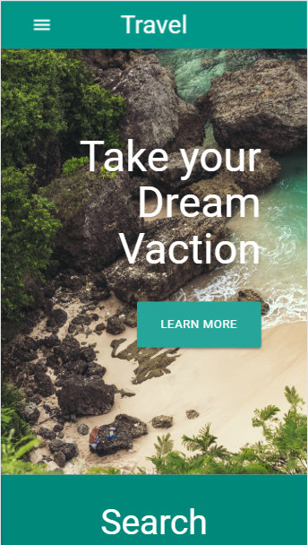

- `Picking item`
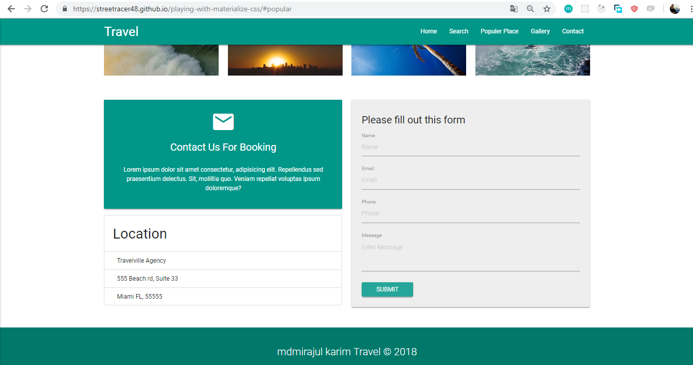

- `Cloud V9  Home`
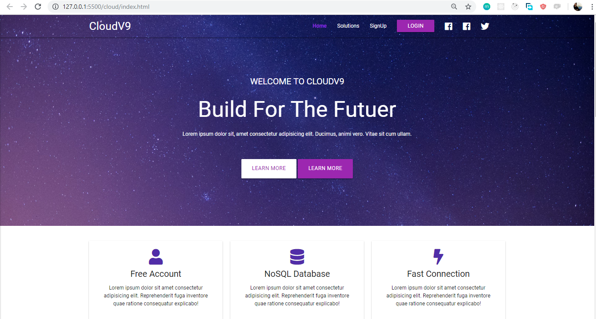

- `Cloud v9 service`
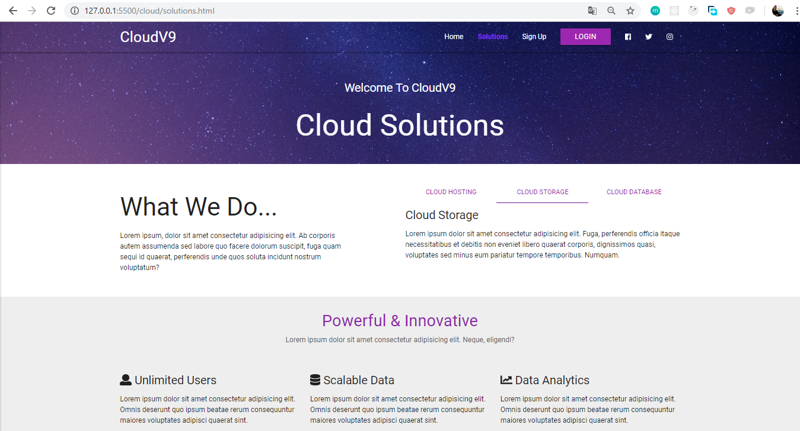

- `Cloud v9 sign UP`
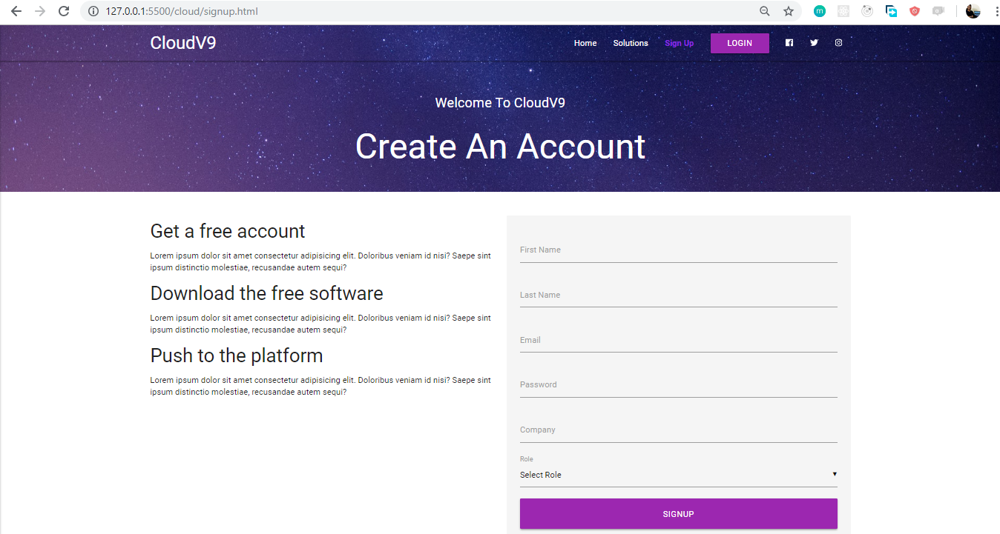

- `Cloud v9 mobile Responsive`
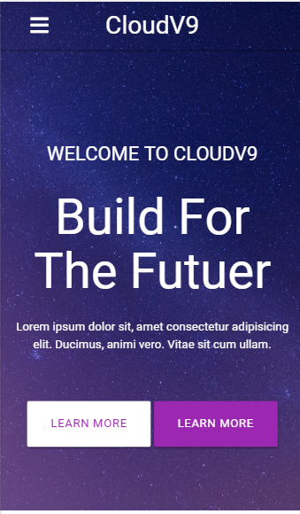

- `Blitz Home`
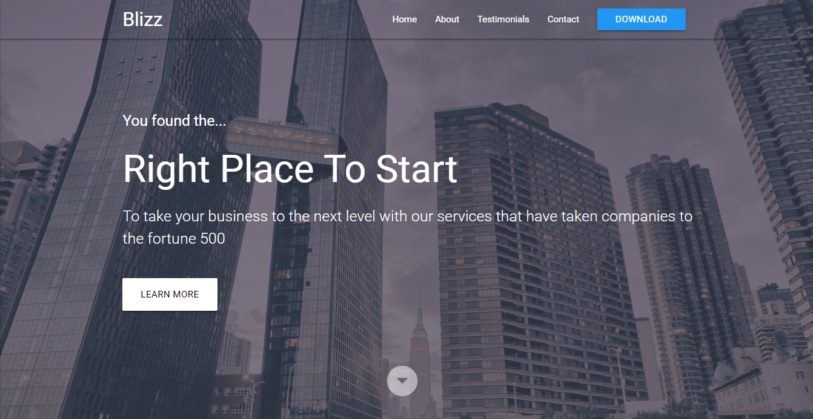
- `Blitz Services`
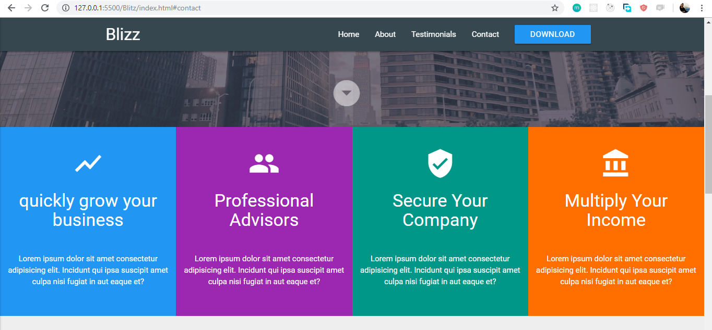

## Following technologies are used

- `Material-CSS`
- `HTML`
- `CSS`
- `Canvas JS`
- `Jquery`
- `Font-Awsome`
- `Materials-icons`
- `Google-fonts`

  
 
     

## Supported Browsers

`By default, the generated project supports all modern browsers and Mobile.`  
   

                                                                                                                                                                                                                                                                                                                                                                     

