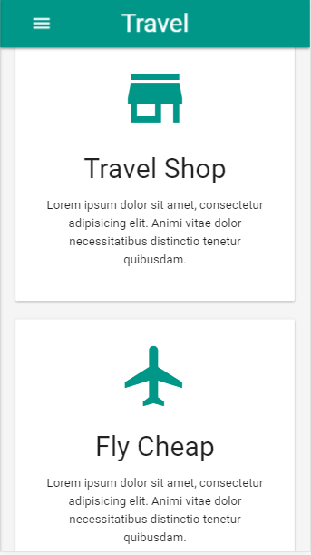

# 

## 3 Projecct making learning based core technology used material-css

## About

 `  Travel agency app, Cloudvp cloud based app, Busniess based appy`

 

## Feature
- `Welcome Travel app,`

- `Most Popular place and ficking`

- `Mobile Responsive`

travelmob2m

- `Mobile Responsive home`

- `Picking item`

- `posts page`

- `users profile system`

- `comments`

- `categories page`

- `add posts modal`

## Following technologies are used

- `Material-CSS`
- `HTML`
- `CSS`
- `Canvas JS`
- `Jquery`
- `Font-Awsome`
- `Materials-icons`
- `Google-fonts`

  
 
     

## Supported Browsers

`By default, the generated project supports all modern browsers and Mobile.`  
   

                                                                                                                                                                                                                                                                                                                                                                     

